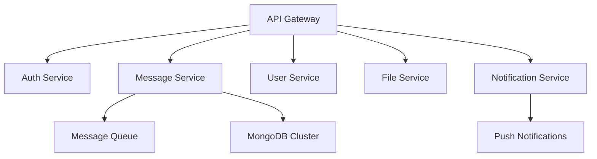

# System Enhancement Proposal - Messenger App

## Executive Summary

This proposal outlines critical enhancements to transform the current messenger prototype into a production-ready, enterprise-grade communication platform. The enhancements focus on **Security**, **Availability**, and **Reliability** as primary pillars.

---

## 🔐 Security Enhancements

### **Authentication & Authorization**

#### **JWT Implementation**

```typescript
// Enhanced JWT Strategy
@Injectable()
export class JwtStrategy extends PassportStrategy(Strategy) {
  constructor() {
    super({
      jwtFromRequest: ExtractJwt.fromAuthHeaderAsBearerToken(),
      ignoreExpiration: false,
      secretOrKey: process.env.JWT_SECRET,
    });
  }

  async validate(payload: any) {
    return {
      userId: payload.sub,
      username: payload.username,
      roles: payload.roles,
    };
  }
}
```

#### **Role-Based Access Control (RBAC)**

```typescript
// Permission-based guards
@UseGuards(JwtAuthGuard, RolesGuard)
@Roles('ADMIN', 'MODERATOR')
@Delete('messages/:id')
async deleteMessage(@Param('id') messageId: string) {
  // Implementation
}
```

#### **API Security Measures**

| Component            | Implementation                 | Benefit                       |
| -------------------- | ------------------------------ | ----------------------------- |
| **Rate Limiting**    | Redis-based sliding window     | Prevent DoS attacks           |
| **Input Validation** | Class-validator + sanitization | Prevent XSS/injection         |
| **CORS Policy**      | Whitelist origins              | Control access origins        |
| **Helmet.js**        | Security headers               | Browser-level protection      |
| **API Keys**         | Service-to-service auth        | Secure internal communication |

### **Data Protection**

#### **Encryption Strategy**

```typescript
// Message encryption service
@Injectable()
export class EncryptionService {
  private readonly algorithm = 'aes-256-gcm';

  async encryptMessage(content: string, conversationKey: string) {
    // End-to-end encryption implementation
    const cipher = crypto.createCipher(this.algorithm, conversationKey);
    return cipher.update(content, 'utf8', 'hex') + cipher.final('hex');
  }
}
```

#### **Privacy Controls**

- **Message Retention Policies**: Auto-delete messages after configurable periods
- **Data Anonymization**: Remove PII from archived messages
- **Consent Management**: User control over data sharing
- **Audit Logging**: Track all data access and modifications

---

## 🚀 Availability Enhancements

### **Horizontal Scaling Architecture**

#### **Microservices Decomposition**


